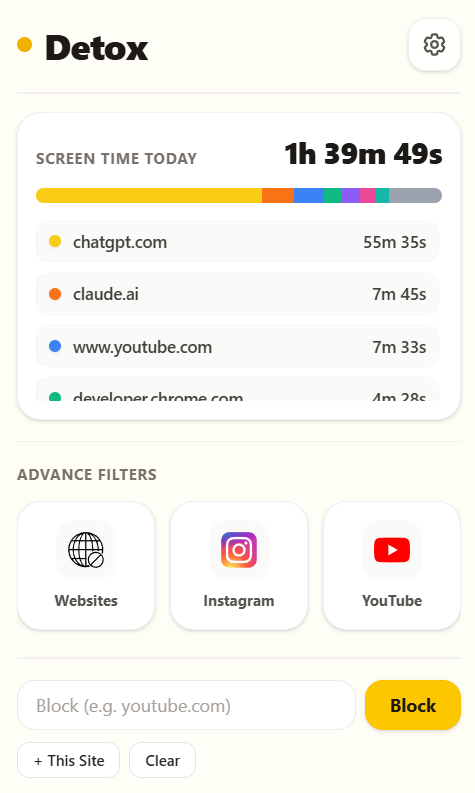

#  Detox

Detox is a browser extension designed to help you regain control of your attention without blocking the entire internet. Instead of all-or-nothing bans, Detox allows you to filter out specific distracting components—like individual YouTube channels, Shorts, or Instagram Reels—and set strict daily budgets for time-sink sites.

---

## Why Detox Exists

Typical website blockers are blunt instruments. They force you to choose between completely blocking websites like YouTube (which you might need for study or work) or leaving them completely open to endless rabbit holes.

Detox exists to provide **surgical blocking**:
* **Keep the utility, block the noise:** Watch educational lectures on YouTube while hiding the distracting recommendations feed and Shorts.
* **Block specific time-wasters:** Block specific channels that hijack your focus while keeping YouTube accessible.
* **Protect your privacy:** Your stats, blocklists, and habits should be yours alone. No cloud sync, no tracking, no subscriptions.

---

## Key Features

### 📺 Channel-level YouTube Blocking
Block specific YouTube channels by handle, channel ID, or display name. Videos from blocked channels will be hidden from search results, sidebar recommendations, and home feeds. If you navigate directly to a blocked channel page, it will immediately redirect you to an intervention screen.

### 🙈 Hide Shorts & Reels
Toggle off YouTube Shorts, YouTube Recommendations feed, Instagram Reels, and Instagram Explore grids. Hiding these features removes infinite-scrolling elements while leaving the core utilities intact.

### ⏳ Daily Site Time Budgets
Define a daily allowance (e.g., 30 minutes) for distracting domains. An elegant, unobtrusive status bar keeps track of your active time. Once the limit is reached, access is intercepted.

### 🔒 Local-only Storage
All usage statistics, blocklists, daily budgets, and toggles are saved locally inside your browser via `chrome.storage.local`. Nothing is uploaded to remote servers, and there are zero tracking analytics.

---

## How It Works

Detox uses an event-driven Architecture:
1. **Background Tracker**: Listens to tab activation, URL updates, and window focus to record screen time in a passive, batch-written structure that terminates gracefully with MV3 lifecycle states.
2. **Dynamic Stylesheets**: Injects light, non-intrusive CSS styles into YouTube and Instagram to hide elements (`ytd-browse`, `ytd-rich-shelf-renderer`, Reels, etc.) rather than running heavy JavaScript loops.
3. **Redirect Interceptor**: Continuously evaluates current tab contexts against channel and domain blocklists and replaces them with beautiful, local interception pages when rules are violated.

---

## Screenshots / GIFs


### Main Dashboard (Popup View)


---

## Installation

### Chrome / Edge / Brave / Opera
1. Download or clone this repository to your local machine.
2. Open Chrome and navigate to `chrome://extensions/`.
3. In the top-right corner, toggle **Developer mode** on.
4. Click **Load unpacked** in the top-left corner.
5. Select the project root directory containing `manifest.json`.

### Firefox
1. Download or clone this repository to your local machine.
2. Open Firefox and navigate to `about:debugging#/runtime/this-firefox`.
3. Click **Load Temporary Add-on...** on the right side.
4. Select the `manifest.json` file in the project root directory.

---

## Usage Guide

1. **Quick-Add Domain**: Open the Detox popup from the toolbar. Type a domain (e.g. `x.com`) into the input field and click **Block** to restrict it, or click **Use Current Tab** to populate the active tab's domain.
2. **Manage Advanced Filters**: Click the website icon (YouTube or Instagram) in the popup dashboard to manage content filters (e.g. toggle Shorts, Recommendations, Reels, or add specific channel handles/links to the blocklist).
3. **Control Budgets**: Set time budgets directly inside the website blocklists.
4. **Import & Export**: Access the Settings panel (via the gear icon) to export your configuration and screen time history to a JSON file, or restore a backup.

---

## Privacy

* **No Telemetry**: Detox collects no browsing behavior, usage metrics, or error logs.
* **No Server Connections**: Detox operates entirely offline.
* **Data Portability**: You can inspect, export, or permanently wipe your local database at any time from the settings panel.

---

## Permissions Explained

To operate, Detox requests the minimum set of permissions:
* `storage`: Required to save your settings, budgets, blocklists, and local screen time statistics.
* `idle`: Required to detect when your browser is inactive so time-tracking pauses.
* `tabs` / `activeTab`: Required to dynamically retrieve the domain of the active tab to update time budgets.
* `declarativeContent` / `scripting`: Required to inject filter stylesheets and intercept blocked domains.

---

## Feature Comparison

| Feature | Detox | Typical Blocker (e.g. BlockSite) |
| :--- | :--- | :--- |
| **YouTube Channel Block** | **Yes (Surgical)** | No (All-or-Nothing YouTube block) |
| **Hide Shorts & Reels** | **Yes (Removes feeds)** | No (Cannot hide sub-elements) |
| **Local-only Storage** | **Yes (Privacy First)** | No (Cloud sync / Data collection) |
| **Pricing** | **Free & Open Source** | Freemium / Paid Subscription |

---

## FAQ

#### Does Detox track my private incognito tabs?
No. Detox does not run in incognito mode by default unless you explicitly allow it in your browser's extension settings.

#### How do I unblock a YouTube channel?
Navigate to the YouTube Blocker advanced settings panel from the popup, and click the "Remove" button next to the blocked channel card.

#### Where is the screen time history saved?
It is saved in your browser's local profile sandbox using the WebExtension Storage API. It is not readable by other websites.

---

## Contributing

We welcome contributions from the community! Whether you are fixing a bug, updating content filters to match new platform layout updates, or suggesting a new feature, feel free to open a PR.

### Development Setup
1. Install Node.js (v16+ recommended).
2. Clone the repository:
   ```bash
   git clone https://github.com/Nisheet-Patel/Detox-Extension.git
   cd Detox-Extension
   ```
3. Install dependencies:
   ```bash
   npm install
   ```

### Build Instructions
Run the build script to copy the required WebExtension polyfills to the vendor directory:
```bash
npm run build
```
Load the root directory into your browser as an unpacked extension.

### Bug Reports & Feature Requests
Please report bugs or request new features by opening an issue on our [GitHub Issues page](https://github.com/Nisheet-Patel/Detox-Extension/issues).

---

## License

This project is licensed under the MIT License. See the [LICENSE](LICENSE) file for details.

---

## Support the Project

If you find Detox useful, consider sharing it with others who want to improve their digital habits, or star our GitHub repository!
